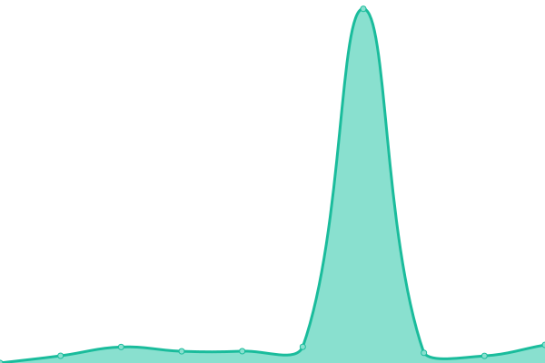
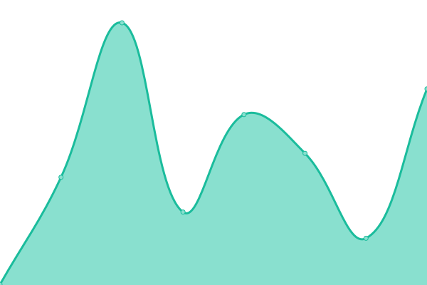

# [📈 Live Status](https://upptime.interoperable.systems): <!--live status--> **🟧 Partial outage**

This repository contains the open-source uptime monitor and status page for [Interoperable Systems](https://interoperable.systems), powered by [Upptime](https://github.com/upptime/upptime).

<!-- BADGIE TIME -->

<!-- END BADGIE TIME -->

With [Upptime](https://upptime.js.org), you can get your own unlimited and free uptime monitor and status page, powered entirely by a GitHub repository. We use [Issues](https://github.com/interoperable/upptime/issues) as incident reports, [Actions](https://github.com/interoperable/upptime/actions) as uptime monitors, and [Pages](https://upptime.interoperable.systems) for the status page.

<!--start: status pages-->
<!-- This summary is generated by Upptime (https://github.com/upptime/upptime) -->
<!-- Do not edit this manually, your changes will be overwritten -->
<!-- prettier-ignore -->
| URL | Status | History | Response Time | Uptime |
| --- | ------ | ------- | ------------- | ------ |
|  [Google](https://www.google.com) | 🟩 Up | [google.yml](https://github.com/interoperable/upptime/commits/HEAD/history/google.yml) | 

 93ms
     
 | 

<a href="https://upptime.interoperable.systems/history/google">100.00%</a>
    

|  [Test Broken Site](https://thissitedoesnotexist.koj.co) | 🟥 Down | [test-broken-site.yml](https://github.com/interoperable/upptime/commits/HEAD/history/test-broken-site.yml) | 

 0ms
     
 | 

<a href="https://upptime.interoperable.systems/history/test-broken-site">100.00%</a>
    

|  [IPv6 test](forwardemail.net) | 🟥 Down | [i-pv6-test.yml](https://github.com/interoperable/upptime/commits/HEAD/history/i-pv6-test.yml) | 

 0ms
     
 | 

<a href="https://upptime.interoperable.systems/history/i-pv6-test">100.00%</a>
    

|  [Plex](https://plex.tv) | 🟩 Up | [plex.yml](https://github.com/interoperable/upptime/commits/HEAD/history/plex.yml) | 

 227ms
     
 | 

<a href="https://upptime.interoperable.systems/history/plex">100.00%</a>
    

|  [Gravatar.com](https://gravatar.com/valiantly040d60ddad) | 🟩 Up | [gravatar-com.yml](https://github.com/interoperable/upptime/commits/HEAD/history/gravatar-com.yml) | 

 417ms
     
 | 

<a href="https://upptime.interoperable.systems/history/gravatar-com">100.00%</a>
    

|  [LinkedIn Profile](https://www.linkedin.com/in/peterpouliot) | 🟥 Down | [linked-in-profile.yml](https://github.com/interoperable/upptime/commits/HEAD/history/linked-in-profile.yml) | 

 516ms
     
 | 

<a href="https://upptime.interoperable.systems/history/linked-in-profile">0.00%</a>
    

|  [Cloudflare](https://cloudflare.com) | 🟩 Up | [cloudflare.yml](https://github.com/interoperable/upptime/commits/HEAD/history/cloudflare.yml) | 

 355ms
     
 | 

<a href="https://upptime.interoperable.systems/history/cloudflare">99.90%</a>
    

|  [DockerHub](https://hub.docker.com/orgs/interoperable/repositories) | 🟥 Down | [docker-hub.yml](https://github.com/interoperable/upptime/commits/HEAD/history/docker-hub.yml) | 

 0ms
     
 | 

<a href="https://upptime.interoperable.systems/history/docker-hub">0.00%</a>
    

|  [Unifi Cloud UI](https://unifi.ui.com) | 🟩 Up | [unifi-cloud-ui.yml](https://github.com/interoperable/upptime/commits/HEAD/history/unifi-cloud-ui.yml) | 

 320ms
     
 | 

<a href="https://upptime.interoperable.systems/history/unifi-cloud-ui">100.00%</a>
    

|  [GitHub-Pages URL](https://interoperable.github.io) | 🟩 Up | [git-hub-pages-url.yml](https://github.com/interoperable/upptime/commits/HEAD/history/git-hub-pages-url.yml) | 

 125ms
     
 | 

<a href="https://upptime.interoperable.systems/history/git-hub-pages-url">100.00%</a>
    

|  [PPouliot GitHub Pages URL](https://ppouliot.github.io) | 🟩 Up | [p-pouliot-git-hub-pages-url.yml](https://github.com/interoperable/upptime/commits/HEAD/history/p-pouliot-git-hub-pages-url.yml) | 

 104ms
     
 | 

<a href="https://upptime.interoperable.systems/history/p-pouliot-git-hub-pages-url">100.00%</a>
    

|  [GitLab-Pages URL](https://interoperable.gitlab.io) | 🟥 Down | [git-lab-pages-url.yml](https://github.com/interoperable/upptime/commits/HEAD/history/git-lab-pages-url.yml) | 

 768ms
     
 | 

<a href="https://upptime.interoperable.systems/history/git-lab-pages-url">0.00%</a>
    

|  [interoperable.systems](https://interoperable.systems) | 🟩 Up | [interoperable-systems.yml](https://github.com/interoperable/upptime/commits/HEAD/history/interoperable-systems.yml) | 

 344ms
     
 | 

<a href="https://upptime.interoperable.systems/history/interoperable-systems">100.00%</a>
    

|  [upptime.interoperable.systems](https://upptime.interoperable.systems) | 🟩 Up | [upptime-interoperable-systems.yml](https://github.com/interoperable/upptime/commits/HEAD/history/upptime-interoperable-systems.yml) | 

 312ms
     
 | 

<a href="https://upptime.interoperable.systems/history/upptime-interoperable-systems">100.00%</a>
    

|  [Synology Diskstation Adiminstration CLI Guide PDF](https://global.download.synology.com/download/Document/Software/DeveloperGuide/Firmware/DSM/All/enu/Synology_DiskStation_Administration_CLI_Guide.pdf) | 🟩 Up | [synology-diskstation-adiminstration-cli-guide-pdf.yml](https://github.com/interoperable/upptime/commits/HEAD/history/synology-diskstation-adiminstration-cli-guide-pdf.yml) | 

 123ms
     
 | 

<a href="https://upptime.interoperable.systems/history/synology-diskstation-adiminstration-cli-guide-pdf">100.00%</a>
    

<!--end: status pages-->

[**Visit our status website →**](https://upptime.interoperable.systems)

## 📄 License

- Powered by: [Upptime](https://github.com/upptime/upptime)
- Code: [MIT](./LICENSE) © [Anand Chowdhary](https://anandchowdhary.com), supported by [Pabio](https://pabio.com)
- Data in the `./history` directory: [Open Database License](https://opendatacommons.org/licenses/odbl/1-0/)
